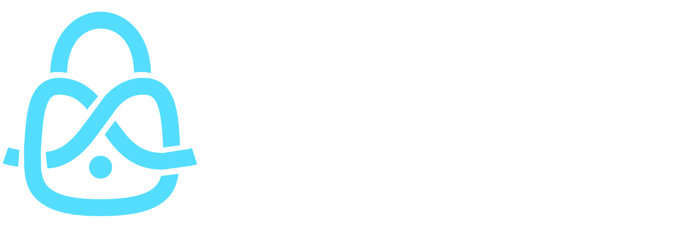

  

<h3 align="center">
    Web3Vault | The web3 password manager
</h3>

   Web3Vault is a cutting-edge solution designed to enhance the security and accessibility of private and sensitive data in the blockchain space. It is a ETHGlobal Brussels hackathon project.

    <a href="#">ETHGlobal Showcase</a>･
    <a href="https://github.com/web3vault/web3vault">Sources</a>

 
Web3Vault is a cutting-edge solution designed to enhance the security and accessibility of private and sensitive data in the blockchain space. This desktop application serves as a secure repository for passwords and personnal notes, leveraging well established encryption methods (like AES256) to safeguard user data and assets. 

Web3Vault is available on the following Operating Systems:

- MacOS (both `arm64` and `amd64`)
- Windows
- Linux

Web3Vault synchronisation is using smart contract deployed on the [Base](https://www.base.org/) network, allowing user to sync their password database between different devices with ease of use, fast and cheap transactions.

You could find the verified contract on the [Base Blockscout block explorer](https://base.blockscout.com/address/0xB85e9607a719a1d51963114aF94F49dAa1335aF1?tab=contract)

## Partners

- [Base](https://www.base.org/)
- [Blockscout](https://blockscout.com/)
- [Privy](https://privy.io/)
- [The Graph](https://thegraph.com/)
- [Web3.Storage / Filecoin](https://web3.storage/)
